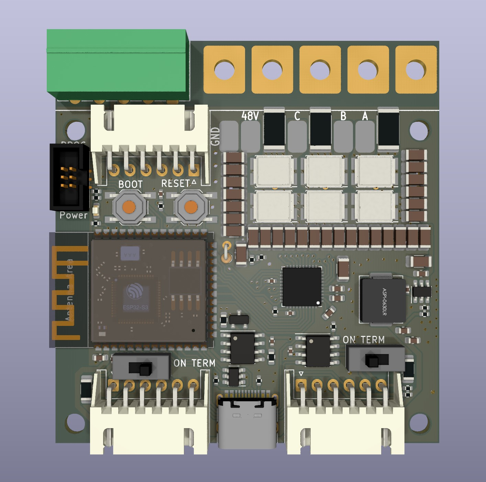

# esp32-bldc - a bldc controller for stationary applications

* Main components are ESP32-S3, DRV8323HRTAR, 6x IRF7480

* Intgrated synchronous step down converter
* CAN-BUS, RS485 (both with switchable termination)
* USB-C, I2C
* All ceramic capacitors
* Power-LED
* Reset Button, Boot Button
* Thermal sensor
* breakable connector area
* optional MT6816 at the bottom PCB side
* parts available at jlcpcb, (5pcs = 113€)
* various GPIO; especially for external magnetic sensor
* desinged with [KiCad](https://www.kicad.org/) with [https://simplefoc.com/](https://simplefoc.com/) in mind
* Four mounting holes
* dimensions 60mm x 52mm (63mm with big connectors)
* currently COMPLETELY untested

